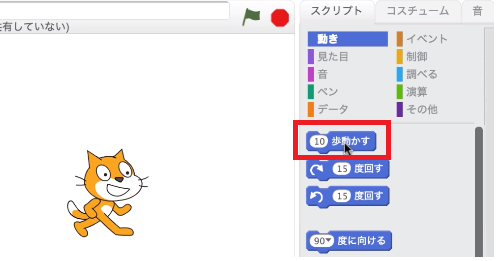
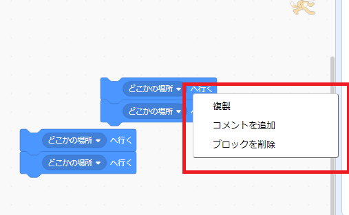
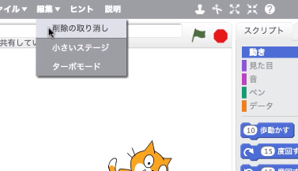
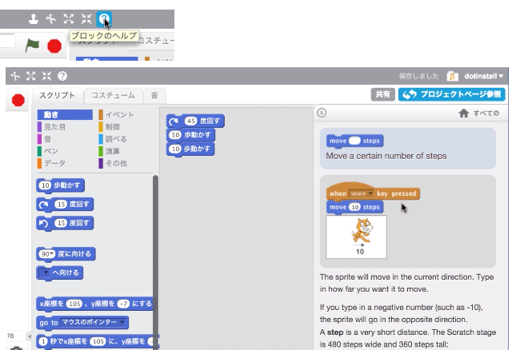
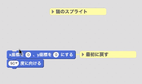
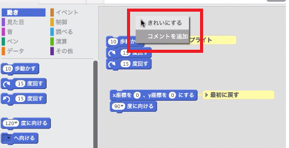
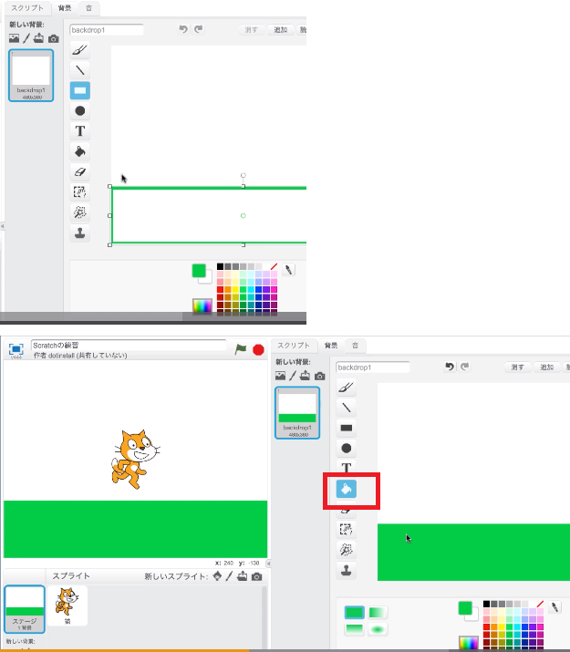

# scratch_game

## 無料で学べるscratch学習のための動画サイト
- [Scratch 2.0入門 (全19回)(どっとインストール)](https://dotinstall.com/lessons/basic_scratch_v3)
- [Scratch-で学習するこどもプログラミング スクラッチで簡単なゲームを作ってみよう！ (udemy)](https://www.udemy.com/scratch-u/)

scratch GitHUB  
https://github.com/LLK/

## 小技集
### ブロックをクリックするだけでもコスチュームは動く
コスチュームを選択して、スクリプトのブロックを直接クリックしてもコスチュームは動く  

### スクリプトを複製、削除する場合  
スクリプトで右クリックし複製、削除ができる。  

間違って削除したスクリプトを戻す場合、編集の削除の取り消しで一回削除したスクリプトを戻すことができる。  

### ヘルプ機能
ブロックの使い方等、ヘルプ機能でブロックの解説がある。  
今のWeb版ではヘルプが無くなり、動画を使ったチュートリアルになっている。  

## コメント追加
スクリプトエリアで右クリックし、コメントを追加することができる。  

## 乱雑になったスクリプトをきれいに整頓する
自動で並び替えることができる。  

## ステージの背景塗りつぶし
線を引いた後、塗りつぶしボタンで塗りつぶし　　

